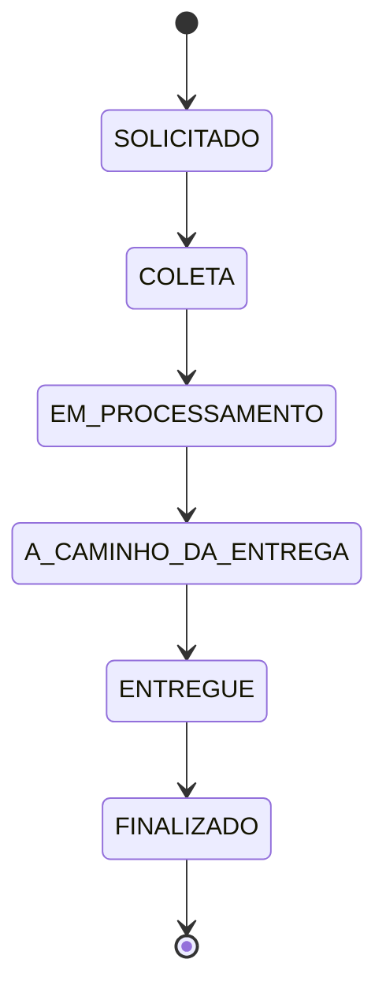

# 🔄 Sistema de Double Check - Documentação Técnica

## 🎯 Visão Geral

O Sistema de Double Check é uma funcionalidade avançada que garante a segurança e rastreabilidade nas entregas através de **confirmação dupla** entre motorista e cliente, eliminando entregas falsas e disputas.

## 🏗️ Arquitetura

### Estados de Status


### Estrutura de Status
Cada transporte possui **3 campos de status independentes**:

```java
@Entity
public class Transporte {
    @Enumerated(EnumType.STRING)
    StatusEntrega statusGeral;      // Status público/geral
    
    @Enumerated(EnumType.STRING) 
    StatusEntrega statusMotorista;  // Controlado pelo motorista
    
    @Enumerated(EnumType.STRING)
    StatusEntrega statusCliente;    // Controlado pelo cliente
}
```

## 🔧 Implementação Técnica

### Enum StatusEntrega
```java
public enum StatusEntrega {
    SOLICITADO,           // 0 - Transporte criado
    COLETA,              // 1 - Em coleta
    EM_PROCESSAMENTO,    // 2 - Sendo processado
    A_CAMINHO_DA_ENTREGA,// 3 - A caminho da entrega
    ENTREGUE,            // 4 - Entregue (confirmado)
    FINALIZADO           // 5 - Finalizado (ambos confirmaram)
}
```

### Métodos da Entidade
```java
public class Transporte {
    
    /**
     * Atualiza status do motorista e verifica finalização
     */
    public void atualizarStatusMotorista(StatusEntrega novoStatus) {
        this.statusMotorista = novoStatus;
        verificarFinalizacao();
    }
    
    /**
     * Atualiza status do cliente e verifica finalização  
     */
    public void atualizarStatusCliente(StatusEntrega novoStatus) {
        this.statusCliente = novoStatus;
        verificarFinalizacao();
    }
    
    /**
     * Lógica de finalização automática
     */
    private void verificarFinalizacao() {
        if (this.statusMotorista == StatusEntrega.ENTREGUE && 
            this.statusCliente == StatusEntrega.ENTREGUE) {
            this.statusGeral = StatusEntrega.FINALIZADO;
        } else {
            this.statusGeral = obterStatusMinimo();
        }
    }
    
    /**
     * Determina status geral baseado no menor status
     */
    private StatusEntrega obterStatusMinimo() {
        return statusMotorista.ordinal() <= statusCliente.ordinal() 
            ? statusMotorista 
            : statusCliente;
    }
}
```

## 🚀 Endpoints da API

### Atualizar Status do Motorista
```http
PUT /transporte/{id}/status/motorista?status={STATUS}
```

**Exemplo:**
```bash
curl -X PUT "http://localhost:8083/transporte/1/status/motorista?status=ENTREGUE"
```

### Atualizar Status do Cliente
```http
PUT /transporte/{id}/status/cliente?status={STATUS}
```

**Exemplo:**
```bash
curl -X PUT "http://localhost:8083/transporte/1/status/cliente?status=ENTREGUE"
```

## 📊 Cenários de Uso

### Cenário 1: Fluxo Normal ✅
```
1. Transporte criado
   • statusGeral: SOLICITADO
   • statusMotorista: SOLICITADO  
   • statusCliente: SOLICITADO

2. Motorista inicia coleta
   PUT /status/motorista?status=COLETA
   • statusGeral: SOLICITADO (mínimo)
   • statusMotorista: COLETA
   • statusCliente: SOLICITADO

3. Cliente confirma coleta
   PUT /status/cliente?status=COLETA  
   • statusGeral: COLETA (ambos)
   • statusMotorista: COLETA
   • statusCliente: COLETA

4. Motorista confirma entrega
   PUT /status/motorista?status=ENTREGUE
   • statusGeral: SOLICITADO (cliente ainda não confirmou)
   • statusMotorista: ENTREGUE
   • statusCliente: SOLICITADO

5. Cliente confirma recebimento  
   PUT /status/cliente?status=ENTREGUE
   • statusGeral: FINALIZADO (automático!)
   • statusMotorista: ENTREGUE
   • statusCliente: ENTREGUE
```

### Cenário 2: Entrega Disputada 🚨
```
Motorista diz: "Entreguei" → status=ENTREGUE
Cliente diz: "Não recebi" → status=A_CAMINHO_DA_ENTREGA

Resultado:
• statusGeral: A_CAMINHO_DA_ENTREGA (menor status)
• Disputa identificada automaticamente
• Necessária intervenção manual
```

### Cenário 3: Cliente Confirma Primeiro ⚡
```
1. Cliente confirma: ENTREGUE
   • statusGeral: SOLICITADO (motorista ainda não confirmou)
   
2. Motorista confirma: ENTREGUE  
   • statusGeral: FINALIZADO (automático!)
```

## 🛡️ Regras de Negócio

### ✅ Permitido
- Motorista pode atualizar **apenas** `statusMotorista`
- Cliente pode atualizar **apenas** `statusCliente`
- Status pode **avançar** na sequência
- Status pode **retroceder** se necessário (disputas)

### ❌ Proibido
- Pular etapas críticas sem justificativa
- Finalizar sem confirmação dupla
- Alterar status após FINALIZADO
- Cliente/motorista alterar status do outro

### 🔐 Validações Automáticas
```java
@Service
public class TransporteService {
    
    @Transactional
    public DetalheTransporteDto atualizarStatusMotorista(Long id, StatusEntrega novoStatus) {
        // 1. Buscar transporte
        Transporte transporte = transporteRepository.findById(id)
            .orElseThrow(() -> new EntityNotFoundException("Transporte não encontrado"));
        
        // 2. Validar se já não está finalizado
        if (transporte.getStatusGeral() == StatusEntrega.FINALIZADO) {
            throw new IllegalStateException("Transporte já finalizado");
        }
        
        // 3. Atualizar e salvar
        transporte.atualizarStatusMotorista(novoStatus);
        Transporte salvo = transporteRepository.save(transporte);
        
        // 4. Log da operação
        logger.info("Status motorista atualizado: transporteId={}, novoStatus={}, statusGeral={}", 
            id, novoStatus, salvo.getStatusGeral());
            
        return new DetalheTransporteDto(salvo);
    }
}
```

## 📱 Integração Frontend

### Exemplo React/JavaScript
```javascript
class TransporteStatus {
    
    // Motorista confirma entrega
    async confirmarEntregaMotorista(transporteId) {
        const response = await fetch(
            `/transporte/${transporteId}/status/motorista?status=ENTREGUE`, 
            { method: 'PUT' }
        );
        
        const transporte = await response.json();
        
        // Verificar se foi finalizado automaticamente
        if (transporte.statusGeral === 'FINALIZADO') {
            this.mostrarSucesso('Transporte finalizado com sucesso!');
        } else {
            this.mostrarAviso('Aguardando confirmação do cliente...');
        }
    }
    
    // Cliente confirma recebimento
    async confirmarRecebimentoCliente(transporteId) {
        const response = await fetch(
            `/transporte/${transporteId}/status/cliente?status=ENTREGUE`,
            { method: 'PUT' }
        );
        
        const transporte = await response.json();
        
        if (transporte.statusGeral === 'FINALIZADO') {
            this.mostrarSucesso('Entrega confirmada! Transporte finalizado.');
            this.habilitarAvaliacao(transporteId);
        }
    }
}
```

### Interface de Status
```jsx
function StatusDisplay({ transporte }) {
    const getStatusColor = (status) => {
        switch(status) {
            case 'FINALIZADO': return 'green';
            case 'ENTREGUE': return 'blue';
            case 'A_CAMINHO_DA_ENTREGA': return 'orange';
            default: return 'gray';
        }
    };
    
    return (
        <div className="status-container">
            <div className="status-geral">
                <span style={{color: getStatusColor(transporte.statusGeral)}}>
                    Status Geral: {transporte.statusGeral}
                </span>
            </div>
            
            <div className="status-detalhes">
                <div>
                    🚛 Motorista: {transporte.statusMotorista}
                </div>
                <div>
                    👤 Cliente: {transporte.statusCliente}
                </div>
            </div>
            
            {transporte.statusGeral === 'FINALIZADO' && (
                <div className="finalizado">
                    ✅ Entrega confirmada por ambas as partes
                </div>
            )}
        </div>
    );
}
```

## 📊 Relatórios e Analytics

### Queries Úteis
```sql
-- Transportes finalizados hoje
SELECT COUNT(*) FROM transporte 
WHERE status_geral = 'FINALIZADO' 
AND DATE(data_atualizacao) = CURDATE();

-- Transportes com disputas (status diferentes)
SELECT * FROM transporte 
WHERE status_motorista = 'ENTREGUE' 
AND status_cliente != 'ENTREGUE'
AND status_geral != 'FINALIZADO';

-- Taxa de finalização por transportadora
SELECT 
    t.nome,
    COUNT(CASE WHEN tr.status_geral = 'FINALIZADO' THEN 1 END) * 100.0 / COUNT(*) as taxa_finalizacao
FROM transportadora t
JOIN transporte tr ON t.id = tr.transportadora_id
GROUP BY t.id, t.nome;
```

### Métricas Importantes
```java
@Service
public class TransporteMetricsService {
    
    public TransporteMetrics calcularMetricas() {
        return TransporteMetrics.builder()
            .totalTransportes(transporteRepository.count())
            .finalizados(transporteRepository.countByStatusGeral(StatusEntrega.FINALIZADO))
            .emAndamento(transporteRepository.countByStatusGeralNot(StatusEntrega.FINALIZADO))
            .disputas(transporteRepository.countDisputas())
            .taxaFinalizacao(calcularTaxaFinalizacao())
            .tempoMedioFinalizacao(calcularTempoMedioFinalizacao())
            .build();
    }
}
```

## 🔔 Notificações

### Eventos Automáticos
```java
@EventListener
public void onStatusChange(TransporteStatusChangeEvent event) {
    Transporte transporte = event.getTransporte();
    
    // Notificar quando finalizado
    if (transporte.getStatusGeral() == StatusEntrega.FINALIZADO) {
        notificationService.enviarNotificacao(
            transporte.getCliente().getEmail(),
            "Entrega finalizada com sucesso!",
            "Seu transporte foi finalizado. Você pode avaliar a transportadora."
        );
        
        notificationService.enviarWhatsapp(
            transporte.getCliente().getTelefone(),
            "🚛 Transporte finalizado! Avalie sua experiência: " + getAvaliacaoLink(transporte.getId())
        );
    }
    
    // Detectar disputas
    if (isDisputa(transporte)) {
        alertService.criarAlerta(
            "Disputa detectada",
            "Transporta " + transporte.getId() + " tem status divergentes",
            TipoAlerta.CRITICO
        );
    }
}
```

## 🧪 Testes

### Testes Unitários
```java
@Test
void testFinalizacaoAutomatica() {
    // Arrange
    Transporte transporte = new Transporte();
    transporte.setStatusMotorista(StatusEntrega.SOLICITADO);
    transporte.setStatusCliente(StatusEntrega.SOLICITADO);
    
    // Act
    transporte.atualizarStatusMotorista(StatusEntrega.ENTREGUE);
    transporte.atualizarStatusCliente(StatusEntrega.ENTREGUE);
    
    // Assert
    assertEquals(StatusEntrega.FINALIZADO, transporte.getStatusGeral());
}

@Test
void testStatusMinimo() {
    // Arrange
    Transporte transporte = new Transporte();
    
    // Act
    transporte.atualizarStatusMotorista(StatusEntrega.ENTREGUE);
    transporte.atualizarStatusCliente(StatusEntrega.A_CAMINHO_DA_ENTREGA);
    
    // Assert - Status geral deve ser o menor
    assertEquals(StatusEntrega.A_CAMINHO_DA_ENTREGA, transporte.getStatusGeral());
}
```

### Testes de Integração
```java
@Test
@Transactional
void testFluxoCompletoDoubleCheck() {
    // 1. Criar transporte
    Long transporteId = criarTransporteTeste();
    
    // 2. Motorista confirma entrega
    transporteService.atualizarStatusMotorista(transporteId, StatusEntrega.ENTREGUE);
    Transporte t1 = transporteRepository.findById(transporteId).get();
    assertNotEquals(StatusEntrega.FINALIZADO, t1.getStatusGeral());
    
    // 3. Cliente confirma recebimento  
    transporteService.atualizarStatusCliente(transporteId, StatusEntrega.ENTREGUE);
    Transporte t2 = transporteRepository.findById(transporteId).get();
    assertEquals(StatusEntrega.FINALIZADO, t2.getStatusGeral());
}
```

## 🎯 Benefícios do Sistema

### ✅ Vantagens
- **Segurança**: Elimina entregas falsas
- **Transparência**: Status claros para todas as partes
- **Automação**: Finalização sem intervenção manual
- **Rastreabilidade**: Histórico completo de mudanças
- **Detecção de Disputas**: Identificação automática de problemas

### 📈 Melhorias Futuras
- **IA para Detecção de Padrões** suspeitos
- **Geolocalização** para confirmar entregas
- **Foto Comprobatória** obrigatória
- **Assinatura Digital** do cliente
- **Notificações Push** em tempo real
- **Dashboard** de disputas para supervisores

---

**Sistema de Double Check** - Garantindo transparência e segurança nas entregas! 🚚✨