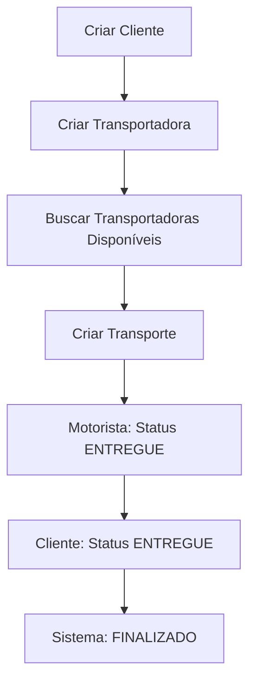

# 🚚 Sistema de Gestão de Frota

Um sistema completo para gestão de transporte e logística, desenvolvido em Spring Boot com funcionalidades avançadas de cálculo de frete e sistema de double check para entregas.

## 🎯 Principais Funcionalidades

### 🔄 Sistema de Double Check
- **Confirmação dupla** de entregas (motorista + cliente)
- **Finalização automática** quando ambos confirmam
- **Rastreabilidade completa** de status

### 💰 Cálculo Inteligente de Frete  
- **Múltiplos fatores**: peso real vs. cubado
- **Preços personalizados** por transportadora
- **Integração Google Maps** para distância real
- **Comparação automática** de preços

### 👥 Gestão Completa
- **Clientes** com validações brasileiras
- **Transportadoras** com avaliações
- **Frota** de caminhões e motoristas
- **Viagens** otimizadas

## 🛠️ Tecnologias

- **Spring Boot** 3.5.5
- **Java** 21
- **MySQL** 8.4
- **JPA/Hibernate** 6.6.26
- **Bean Validation**
- **Lombok**
- **Google Maps API**

## 🚀 Quick Start

### Pré-requisitos
- Java 21+
- MySQL 8.4+
- Maven 3.9+
- Google Maps API Key

### Configuração

1. **Clone o repositório**
```bash
git clone https://github.com/bieldnz/frota-trabalho.git
cd frota-trabalho
```

2. **Configure o banco de dados**
```sql
CREATE DATABASE frota CHARACTER SET utf8mb4 COLLATE utf8mb4_unicode_ci;
```

3. **Configure application.properties**
```properties
spring.datasource.url=jdbc:mysql://localhost:3307/frota
spring.datasource.username=root
spring.datasource.password=sua_senha
google.maps.api.key=sua_api_key_google_maps
```

4. **Execute a aplicação**
```bash
# Desenvolvimento
./mvnw spring-boot:run

# Produção com Docker
docker-compose up
```

## 📱 Testando a API

### Insomnia Collection
Importe o arquivo `insomnia_collection.json` que contém:
- ✅ **83 endpoints** configurados
- 🧪 **Dados de teste** prontos
- 📋 **Cenários completos** de uso

### Fluxo de Teste


## 🏗️ Arquitetura

```
📁 com.example.frota
├── 👥 cliente/          # Gestão de clientes
├── 🚚 transportadora/   # Empresas de transporte  
├── 📦 transporte/       # Solicitações de transporte
├── 📋 caixa/           # Tipos de embalagens
├── 🚛 caminhao/        # Frota de veículos
├── 👨‍💼 motorista/       # Motoristas e localização
├── 🗺️ viagem/           # Agrupamento de transportes
└── ⭐ avaliacao/       # Sistema de feedback
```

## 📊 Banco de Dados

### Principais Entidades
- **Cliente**: Dados pessoais + endereço + validações BR
- **Transportadora**: CNPJ + preços + avaliação
- **Transporte**: Produto + origem/destino + 3 status
- **Caixa**: Dimensões + peso máximo
- **Viagem**: Agrupamento + motorista + caminhão

### Relacionamentos
```sql
Cliente 1:N Transporte N:1 Transportadora
Transporte N:1 Caixa
Transporte N:1 Viagem N:1 Motorista
```

## 🎮 Funcionalidades por Módulo

### 👥 Cliente
```http
POST   /clientes                    # Criar
GET    /clientes                    # Listar (paginado)
GET    /clientes/{id}               # Buscar por ID
PUT    /clientes/{id}               # Atualizar  
DELETE /clientes/{id}               # Desativar
GET    /clientes/buscar/email       # Buscar por email
```

### 🚚 Transportadora
```http
POST   /transportadoras             # Criar
GET    /transportadoras             # Listar (filtros)
PUT    /transportadoras/{id}        # Atualizar
PUT    /transportadoras/{id}/avaliacao  # Avaliar
GET    /transportadoras/buscar/nome # Buscar por nome
GET    /transportadoras/buscar/cnpj # Buscar por CNPJ
```

### 📦 Transporte  
```http
POST   /transporte                  # Criar (com cliente + transportadora)
GET    /transporte/disponiveis      # Buscar transportadoras + frete
PUT    /transporte/{id}/status/motorista   # Status motorista
PUT    /transporte/{id}/status/cliente     # Status cliente
```

## 🔧 Configuração Avançada

### Docker Compose
```yaml
services:
  app:
    build: .
    ports:
      - "8083:8083"
      - "5005:5005"  # Debug
    environment:
      - SPRING_PROFILES_ACTIVE=docker
      
  db:
    image: mysql:8.4
    ports:
      - "3307:3306"
    environment:
      MYSQL_ROOT_PASSWORD: frota123
      MYSQL_DATABASE: frota
```

### Debug no VS Code
```json
{
  "type": "java",
  "name": "Spring Boot Local",
  "request": "launch",
  "mainClass": "com.example.frota.FrotaApplication",
  "args": "--server.port=8084"
},
{
  "type": "java",  
  "name": "Attach Docker",
  "request": "attach",
  "hostName": "localhost",
  "port": 5005
}
```

## 📈 Recursos Especiais

### 🎯 Sistema de Double Check
Garante segurança nas entregas através de confirmação dupla:

1. **Motorista** confirma entrega → `statusMotorista = ENTREGUE`
2. **Cliente** confirma recebimento → `statusCliente = ENTREGUE`  
3. **Sistema** automaticamente → `statusGeral = FINALIZADO`

### 💡 Cálculo de Frete Inteligente
```java
// Algoritmo considera múltiplos fatores
peso_considerado = max(peso_real, peso_cubado)
peso_cubado = (comp × larg × alt) × fator_cubagem

frete_peso = (peso × valor_kg) + (km × valor_km) + pedágio
frete_caixa = (qtd × valor_caixa) + (km × valor_km) + pedágio

frete_final = max(frete_peso, frete_caixa)
```

### 🗺️ Integração Google Maps
- **Distância real** entre origem e destino
- **Cálculo de pedágio** quando disponível  
- **Cache de rotas** para otimização

## 🚨 Tratamento de Erros

### Validações Automáticas
- **Cliente**: Email único, telefone BR, CPF válido
- **Transportadora**: CNPJ único, preços positivos
- **Transporte**: Produto cabe na caixa, entidades ativas

### Exceções Customizadas
```java
ClienteNotFoundException
TransportadoraNotFoundException  
ProdutoNaoCabeNaCaixaException
EmailJaExisteException
CNPJJaExisteException
```

## 📊 Monitoramento

### Logs Estruturados
```java
// Exemplo de log com contexto
logger.info("Transporte criado: id={}, cliente={}, transportadora={}, valor={}", 
    transporte.getId(), cliente.getNome(), transportadora.getNome(), valorFrete);
```

### Métricas Importantes
- Tempo de resposta das APIs
- Taxa de finalização de entregas  
- Avaliação média das transportadoras
- Volume de transportes por região

## 🤝 Contribuição

1. **Fork** o projeto
2. **Crie** uma branch: `git checkout -b feature/nova-funcionalidade`
3. **Commit** suas mudanças: `git commit -m 'Adiciona nova funcionalidade'`
4. **Push** para a branch: `git push origin feature/nova-funcionalidade`  
5. **Abra** um Pull Request

## 📝 Roadmap

### 🔄 Próximas Versões
- [ ] **Notificações** WhatsApp/SMS em tempo real
- [ ] **Dashboard** administrativo com métricas
- [ ] **API Mobile** para motoristas  
- [ ] **Geolocalização** em tempo real
- [ ] **Relatórios** avançados de performance
- [ ] **Integração** com outros mapas (Waze, Here)
- [ ] **Machine Learning** para previsão de demanda

### 🛡️ Melhorias de Segurança  
- [ ] **JWT Authentication**
- [ ] **Rate Limiting**
- [ ] **HTTPS** obrigatório
- [ ] **Audit Log** completo

## 📞 Suporte

- 📧 **Email**: suporte@frota.com
- 📱 **WhatsApp**: (11) 99999-9999
- 🐛 **Issues**: [GitHub Issues](https://github.com/bieldnz/frota-trabalho/issues)
- 📖 **Wiki**: [Documentação Completa](./API_DOCUMENTATION.md)

## 📄 Licença

Este projeto está sob a licença MIT. Veja o arquivo [LICENSE](LICENSE) para detalhes.

---

<div align="center">

**Desenvolvido com ❤️ para otimizar a logística brasileira**

[🌟 Star](https://github.com/bieldnz/frota-trabalho) • [🍴 Fork](https://github.com/bieldnz/frota-trabalho/fork) • [📞 Suporte](mailto:suporte@frota.com)

</div>