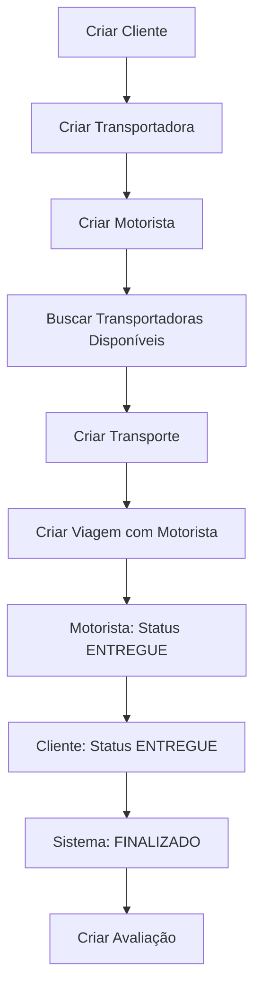

# 🚚 Sistema de Gestão de Frota

Um sistema completo para gestão de transporte e logística, desenvolvido em Spring Boot com funcionalidades avançadas de cálculo de frete, gestão de motoristas e sistema de double check para entregas.

## 🎯 Principais Funcionalidades

### 👨‍💼 Gestão Completa de Motoristas
- **CRUD completo** com CNH obrigatória
- **Status de disponibilidade** (disponível/ocupado)
- **Status ativo/inativo** para controle
- **Localização em tempo real** com coordenadas
- **Integração obrigatória** com viagens

### 🔄 Sistema de Double Check
- **Confirmação dupla** de entregas (motorista + cliente)
- **Finalização automática** quando ambos confirmam
- **Rastreabilidade completa** de status

### 💰 Cálculo Inteligente de Frete  
- **Múltiplos fatores**: peso real vs. cubado
- **Preços personalizados** por transportadora
- **Integração Google Maps** para distância real
- **Comparação automática** de preços
- **Formatação monetária** com 2 decimais
- **Cálculo corrigido** com fatores realistas

### 👥 Gestão Completa
- **Clientes** com validações brasileiras
- **Transportadoras** com avaliações e estatísticas
- **Frota** de caminhões com manutenção
- **Viagens** otimizadas com motorista obrigatório
- **Sistema de avaliações** pós-entrega


## 🚀 Quick Start

### Pré-requisitos
- Java 21+
- MySQL 8.4+
- Maven 3.9+
- Google Maps API Key

### Configuração

1. **Clone o repositório**
```bash
git clone https://github.com/bieldnz/frota-trabalho.git
cd frota-trabalho
```

2. **Configure o banco de dados**
```sql
CREATE DATABASE frota CHARACTER SET utf8mb4 COLLATE utf8mb4_unicode_ci;
```

3. **Configure as variáveis de ambiente**
```bash
# Copie o arquivo de exemplo
cp .env.example .env

# Edite o arquivo .env e configure sua Google Maps API Key
# API_KEY=sua_api_key_google_maps_aqui
```

4. **Configure application.properties (desenvolvimento local)**
```properties
spring.datasource.url=jdbc:mysql://localhost:3307/frota
spring.datasource.username=root
spring.datasource.password=sua_senha
google.maps.api.key=${API_KEY}
```

5. **Execute a aplicação**
```bash
# Desenvolvimento local (requer MySQL local)
./mvnw spring-boot:run

# Produção com Docker (recomendado)
docker-compose up --build
```

**⚠️ Importante**: Obtenha sua Google Maps API Key em [Google Cloud Console](https://developers.google.com/maps/documentation/distance-matrix/get-api-key)

## 📱 Testando a API

### Insomnia Collection
Importe o arquivo `insomnia_collection.json` que contém:
- ✅ **100+ endpoints** configurados
- 🧪 **Dados de teste** prontos  
- 📋 **Cenários completos** de uso
- 🔧 **URLs corrigidas** e atualizadas

### Principais Endpoints
```http
# MOTORISTAS
POST   /motorista                       # Criar (CNH obrigatória)
PUT    /motorista/{id}/disponibilidade  # Alterar disponibilidade  
PUT    /motorista/{id}/ativo            # Ativar/desativar
GET    /motorista/cpf/{cpf}             # Buscar por CPF
GET    /motorista/cnh/{cnh}             # Buscar por CNH
GET    /motorista/contadores/disponiveis # Contar disponíveis

# TRANSPORTE
GET    /transporte/disponiveis          # Buscar com frete calculado
PUT    /transporte/{id}/status/motorista # Status motorista
PUT    /transporte/{id}/status/cliente   # Status cliente

# VIAGENS (NOVO)
POST   /viagem                          # Criar (motorista obrigatório)
PUT    /viagem/{id}/finalizar           # Finalizar com KM e combustível
```

### Fluxo de Teste Completo


## 🏗️ Arquitetura

```
📁 com.example.frota
├── 👥 cliente/          # Gestão completa de clientes
├── 🚚 transportadora/   # Empresas com estatísticas  
├── 📦 transporte/       # Solicitações com double-check
├── 📋 caixa/           # Tipos e capacidades
├── 🚛 caminhao/        # Frota com manutenção
├── 👨‍💼 motorista/       # CNH + disponibilidade + localização
├── 🗺️ viagem/           # Agrupamento obrigatório com motorista
├── ⭐ avaliacao/       # Sistema de feedback
├── 🔧 manutencao/      # Controle preventivo
├── 📊 planejamento/    # Sugestões inteligentes
└── ❌ errors/          # Tratamento centralizado
```

## 📊 Banco de Dados

### Principais Entidades
- **Cliente**: Dados pessoais + endereço + validações BR
- **Transportadora**: CNPJ + preços + avaliação + estatísticas
- **Motorista**: CNH obrigatória + ativo + disponível + localização
- **Transporte**: Produto + origem/destino + 3 status (geral, motorista, cliente)
- **Viagem**: Motorista obrigatório + agrupamento + KM + combustível
- **Caixa**: Dimensões + peso máximo
- **Manutenção**: Controle preventivo da frota
- **Avaliação**: Feedback pós-entrega

### Relacionamentos
```sql
Cliente 1:N Transporte N:1 Transportadora
Transporte N:1 Caixa
Transporte N:1 Viagem N:1 Motorista
Transporte N:1 Viagem N:1 Caminhao
Transporte 1:N Avaliacao
Caminhao 1:N Manutencao
```

## 🎮 Funcionalidades por Módulo

### 👥 Cliente
```http
POST   /clientes                    # Criar com validações BR
GET    /clientes                    # Listar (paginado)
GET    /clientes/{id}               # Buscar por ID
PUT    /clientes/{id}               # Atualizar  
DELETE /clientes/{id}               # Desativar
GET    /clientes/buscar             # Buscar por nome
GET    /clientes/buscar/email       # Buscar por email
GET    /clientes/estatisticas       # Estatísticas gerais
```

### 🚚 Transportadora
```http
POST   /transportadoras             # Criar com preços
GET    /transportadoras             # Listar com filtros
PUT    /transportadoras/{id}        # Atualizar dados
PUT    /transportadoras/{id}/avaliacao  # Atualizar avaliação
DELETE /transportadoras/{id}        # Desativar
GET    /transportadoras/buscar/nome # Buscar por nome
GET    /transportadoras/buscar/cnpj # Buscar por CNPJ
GET    /transportadoras/avaliacoes  # Por avaliação mínima
GET    /transportadoras/top         # Top transportadoras
GET    /transportadoras/ativas      # Apenas ativas
GET    /transportadoras/estatisticas # Estatísticas gerais
```

### 👨‍💼 Motorista (NOVO MÓDULO COMPLETO)
```http
POST   /motorista                   # Criar (CNH obrigatória)
PUT    /motorista                   # Atualizar dados
PUT    /motorista/{id}/disponibilidade # Alterar disponibilidade
PUT    /motorista/{id}/ativo        # Ativar/desativar
PUT    /motorista/{id}/localizacao  # Atualizar GPS
GET    /motorista/{id}              # Buscar por ID
GET    /motorista                   # Listar todos
GET    /motorista/paginado          # Listar paginado
GET    /motorista/buscar            # Buscar por nome
GET    /motorista/cpf/{cpf}         # Buscar por CPF
GET    /motorista/cnh/{cnh}         # Buscar por CNH
GET    /motorista/contadores/disponiveis # Contar disponíveis
POST   /motorista/rastrear          # Rastreamento
PUT    /motorista/entregar/{id}     # Finalizar entrega
```

### 📦 Transporte  
```http
POST   /transporte                  # Criar completo
GET    /transporte                  # Listar todos
GET    /transporte/{id}             # Buscar por ID
GET    /transporte/caixa/{id}       # Por caixa
PUT    /transporte/{id}             # Atualizar
PUT    /transporte/{id}/status/{status} # Status geral
DELETE /transporte/{id}             # Cancelar
GET    /transporte/disponiveis      # Buscar com frete calculado
PUT    /transporte/{id}/status/motorista # Status motorista
PUT    /transporte/{id}/status/cliente  # Status cliente
```

### 🗺️ Viagem
```http
POST   /viagem                      # Criar (motorista obrigatório)
GET    /viagem                      # Listar todas
GET    /viagem/{id}                 # Buscar por ID
PUT    /viagem/{id}/finalizar       # Finalizar com KM/combustível
DELETE /viagem/{id}                 # Cancelar viagem
```

### 🔧 Manutenção
```http
POST   /manutencao                  # Registrar manutenção
GET    /manutencao                  # Listar todas
GET    /manutencao/{id}             # Buscar por ID
GET    /manutencao/alerta/{caminhaoId} # Alertas por caminhão
```

### ⭐ Avaliação
```http
POST   /avaliacao                   # Registrar feedback
GET    /avaliacao                   # Listar todas
GET    /avaliacao/{id}              # Buscar por ID
```

## 🔧 Configuração Avançada

### Docker Compose
```yaml
services:
  app:
    build: .
    ports:
      - "8083:8083"
      - "5005:5005"  # Debug
    environment:
      - SPRING_PROFILES_ACTIVE=docker
      - API_KEY=${API_KEY}  # Carregado do arquivo .env
    env_file:
      - .env  # Carrega variáveis do arquivo .env
      
  db:
    image: mysql:8.4
    ports:
      - "3307:3306"
    environment:
      MYSQL_ROOT_PASSWORD: cco123
      MYSQL_DATABASE: frota
    env_file:
      - .env
```

### Variáveis de Ambiente (.env)
```env
# Google Maps API Key (OBRIGATÓRIO)
API_KEY=YOUR_GOOGLE_MAPS_API_KEY_HERE

# Database Configuration
MYSQL_ROOT_PASSWORD=cco123
MYSQL_DATABASE=frota
MYSQL_USER=frota
MYSQL_PASSWORD=frota

# Spring Boot Configuration  
SERVER_PORT=8083
```

**🔒 Segurança**: O arquivo `.env` está no `.gitignore` para proteger suas credenciais.

### Debug no VS Code
```json
{
  "type": "java",
  "name": "Spring Boot Local",
  "request": "launch",
  "mainClass": "com.example.frota.FrotaApplication",
  "args": "--server.port=8084"
},
{
  "type": "java",  
  "name": "Attach Docker",
  "request": "attach",
  "hostName": "localhost",
  "port": 5005
}
```

## 📈 Recursos Especiais

### 🎯 Sistema de Double Check
Garante segurança nas entregas através de confirmação dupla:

1. **Motorista** confirma entrega → `statusMotorista = ENTREGUE`
2. **Cliente** confirma recebimento → `statusCliente = ENTREGUE`  
3. **Sistema** automaticamente → `statusGeral = FINALIZADO`


### 🔧 Sistema de Tratamento de Erros
```java
// Motorista
CnhJaExisteException
CpfJaExisteException  
MotoristaInativoException
MotoristaIndisponivelException

// Cliente/Transportadora
EmailJaExisteException
CnpjJaExisteException

// Negócio
ProdutoNaoCabeNaCaixaException
ViagemJaFinalizadaException
TransporteJaEntregueException
```

### 🗺️ Integração Google Maps
- **Distância real** entre origem e destino
- **Cálculo de pedágio** quando disponível  
- **Cache de rotas** para otimização

## 🚨 Tratamento de Erros

### Validações Automáticas
- **Cliente**: Email único, telefone BR, CPF válido
- **Transportadora**: CNPJ único, preços positivos
- **Motorista**: CNH única, CPF único, validações específicas
- **Transporte**: Produto cabe na caixa, entidades ativas
- **Viagem**: Motorista disponível, caminhão disponível

### Exceções Customizadas por Módulo
```java
// Cliente
ClienteNotFoundException
EmailJaExisteException

// Transportadora  
TransportadoraNotFoundException
CnpjJaExisteException

// Motorista
MotoristaNotFoundException
CnhJaExisteException
CpfJaExisteException
MotoristaInativoException
MotoristaIndisponivelException

// Transporte/Viagem
ProdutoNaoCabeNaCaixaException
ViagemJaFinalizadaException
TransporteJaEntregueException
```

### GlobalExceptionHandler
Tratamento centralizado com respostas padronizadas:
```java
@RestControllerAdvice
public class GlobalExceptionHandler {
    // Retorna status HTTP apropriado + mensagem clara
    // Log estruturado para debugging
    // Validação automática de campos
}
```

## 📊 Monitoramento

### Logs Estruturados
```java
// Exemplo de logs com contexto completo
logger.info("Transporte criado: id={}, cliente={}, transportadora={}, valor={}", 
    transporte.getId(), cliente.getNome(), transportadora.getNome(), valorFrete);

logger.info("Motorista {} alterou disponibilidade para: {}", 
    motorista.getNome(), disponivel);

logger.info("Cálculo de frete - Peso real: {}, Peso cubado: {}, Peso considerado: {}", 
    pesoReal, pesoCubado, pesoConsiderado);
```

### Métricas Importantes
- **Performance**: Tempo de resposta das APIs
- **Negócio**: Taxa de finalização de entregas  
- **Qualidade**: Avaliação média das transportadoras
- **Operacional**: Volume de transportes por região
- **Frota**: Motoristas disponíveis vs. ocupados
- **Financeiro**: Valor médio de frete calculado

### Endpoints de Estatísticas
```http
GET /clientes/estatisticas        # Clientes ativos/inativos
GET /transportadoras/estatisticas # Performance transportadoras  
GET /motorista/contadores/disponiveis # Disponibilidade em tempo real
```

## 🤝 Contribuição

1. **Fork** o projeto
2. **Crie** uma branch: `git checkout -b feature/nova-funcionalidade`
3. **Commit** suas mudanças: `git commit -m 'Adiciona nova funcionalidade'`
4. **Push** para a branch: `git push origin feature/nova-funcionalidade`  
5. **Abra** um Pull Request

## 📝 Roadmap

### 🔄 Próximas Versões

- [ ] **Dashboard** administrativo com métricas
- [ ] **Relatórios** avançados de performance
- [ ] **Integração** com outros mapas (Waze, Here)
- [ ] **Machine Learning** para previsão de demanda
- [ ] **Otimização de rotas** automática

### 🛡️ Melhorias de Segurança  
- [ ] **JWT Authentication**
- [ ] **Rate Limiting**
- [ ] **HTTPS** obrigatório
- [ ] **Audit Log** completo
- [ ] **Criptografia** de dados sensíveis

### 🚀 Performance e Escalabilidade
- [ ] **Cache Redis** para consultas frequentes
- [ ] **Message Queue** para processamento assíncrono
- [ ] **Load Balancer** para alta disponibilidade
- [ ] **Database replication** para leitura

## 📞 Suporte

- 🐛 **Issues**: [GitHub Issues](https://github.com/bieldnz/frota-trabalho/issues)
- 📖 **Wiki**: [Documentação Completa](./API_DOCUMENTATION.md)

## 📄 Licença

Este projeto está sob a licença MIT. Veja o arquivo [LICENSE](LICENSE) para detalhes.

---

<div align="center">

**Desenvolvido com ❤️ para otimizar a logística brasileira**

[🌟 Star](https://github.com/bieldnz/frota-trabalho) • [🍴 Fork](https://github.com/bieldnz/frota-trabalho/fork) • [📞 Suporte](mailto:suporte@frota.com)

</div>